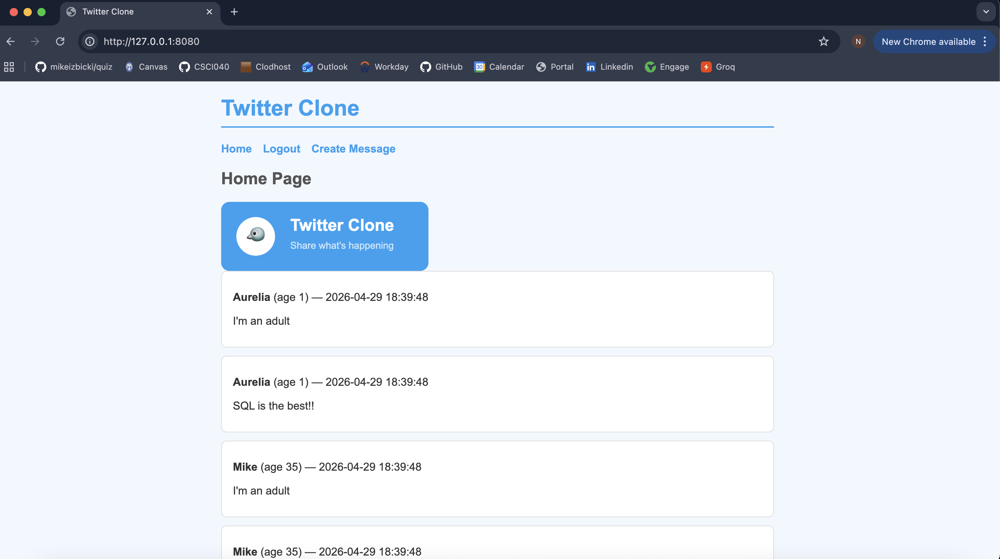

# Twitter Clone

A Twitter clone web application built with FastAPI, Jinja2 templates, and SQLite.

## Features

- View messages from all users on the home page
- Messages display the author's username, age, and timestamp
- User login and registration pages
- Create new messages

## Screenshot



## Setup

Install dependencies:

```
pip install -r requirements.txt
```

Initialize the database:

```
python db_create.py
```

Run the app:

```
python main.py
```

Then open `http://127.0.0.1:8080` in your browser.
